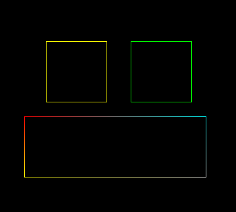

# Rasterização
Projeto realizado para a disciplina de Introdução a Computação Gráfica. 
Um framework OpenGL simulando acesso direto à memória de vídeo foi fornecido. Sobre este foi desenvolvido o código.

## Objetivo
Criar uma solução para rasterizar linhas e pontos. Através da rasterização de linhas serão desenhadas formas geométricas. A cor de cada linha será calculada através da interpolação linear entre as cores de seu vértice inicial e final.

## Concluído
- [X] Pontos
- [X] Linhas
- [X] Interpolação de cores
- [X] Triângulos
- [X] Quadrados
- [X] Círculos

## Desenvolvimento
  A principal técnica utilizada foi o algoritmo de Bresenham para linhas e generalizado para rasterizar círculos. O sistema de cores usado é o RGBA, com cada canal representado por 8 bits. 

### Ponto
  Com acesso direto à memória, o pixel desejado pode ter a intensidade de seus canais de cor alterados através de suas coordenadas x e y. Seja W a largura total da janela, com 4 canais de cores o primeiro byte de cada pixel é encontrado através da fórmula:

<p align="center">  </p>

###### Exemplo de código:
 ``` C
  void PutPixel(tPonto p){
    FBptr[p.x*4 + p.y*IMAGE_WIDTH*4 + 0] = p.cor.R;
    FBptr[p.x*4 + p.y*IMAGE_WIDTH*4 + 1] = p.cor.G;
    FBptr[p.x*4 + p.y*IMAGE_WIDTH*4 + 2] = p.cor.B;
    FBptr[p.x*4 + p.y*IMAGE_WIDTH*4 + 3] = p.cor.A;
}
```
###### Resultado:
<p align="center">  </p>

### Linha  
  No sistema de coordenadas desta aplicação, a posição (0,0) encontra-se no canto superior esquerdo. A aplicação direta do algoritmo de Bresenham nestas condições, com `0 <= dy/dx <= 1`, produz retas apenas no 1º quadrante:
  
  <p align="center">  </p>
  
  Para permitir a rasterização de linhas em outras direções foram realizadas operações de simetria:
  
###### Exemplo de código:
  ```C
  if(dx < 0){
      DrawLine(p1, p0);
      return;
    }
  if(dy < 0){
    incremento_y = -1;
    dy = -dy;
  }
  ```
  ###### Resultado:
  
  <p align="center">  </p>
  
  Como já dito, todas as operações anteriores só funcionam para dy < dx. A solução é novamente operações de simetria, desta vez feitas usando Y como referência. O resultado são linhas que podem ser rasterizadas em todas as direções.
  
Em verde:    `dy > dx.` <br>
Em vermelho: `dy <= dx.`

  <p align="center">  </p>
  
### Interpolação de Cor
  A transição de cor entre os vértices foi feito através da interpolação linear dos canais de cor. 

<p align="center"> ,   </p>

###### Resultado
<p align="center">  </p>

### Triângulo e Quadrado
  Fornecidos os respectivos vértices do polígono, são rasterizadas as linhas que formam suas arestas. 

<p align="center">    </p>

### Círculo

<p align="center">  </p>

## Discussão e Problemas Encontrados


