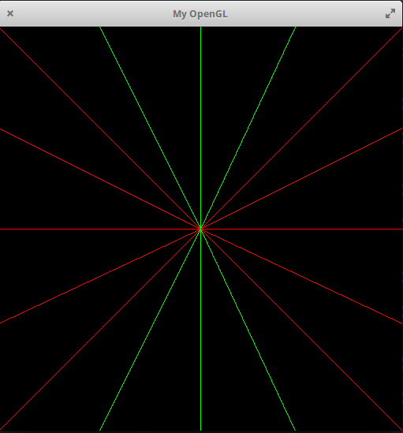
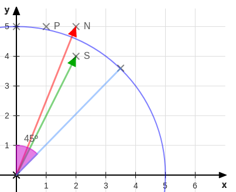
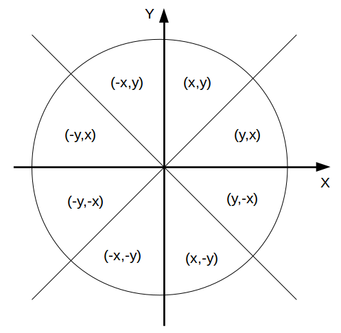
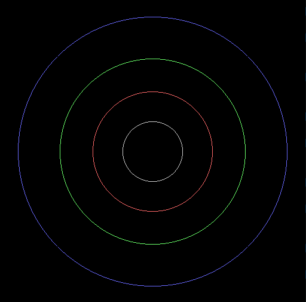
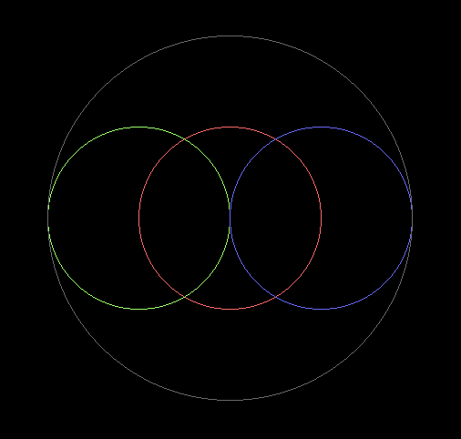
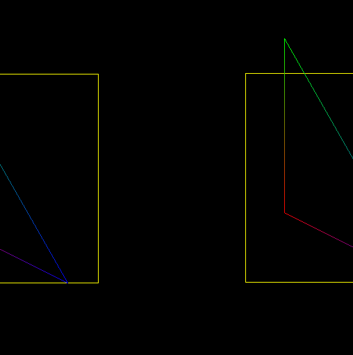
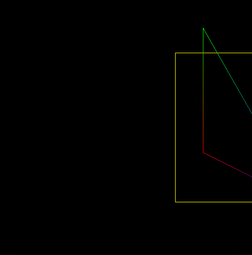

# Rasterização
Projeto realizado para a disciplina de Introdução à Computação Gráfica. 
Um framework OpenGL simulando acesso direto à memória de vídeo foi fornecido. Sobre este foi desenvolvido o código.

## Objetivo
Criar uma solução para rasterizar linhas, pontos e formas geométricas. A cor de cada linha será calculada através da interpolação linear entre as cores de seu vértice inicial e final.

## Concluído
- [X] Pontos
- [X] Linhas
- [X] Interpolação de cores
- [X] Triângulos
- [X] Retângulos
- [X] Círculos

## Desenvolvimento
  A principal técnica utilizada foi o algoritmo de Bresenham para linhas e generalizado para rasterizar círculos. O sistema de cores usado é o RGBA, com cada canal representado por 8 bits. 

### Ponto
  Com acesso direto à memória, o pixel desejado pode ter a intensidade de seus canais de cor alterados através de suas coordenadas x e y. Seja W a largura total da janela, com 4 canais de cores o primeiro byte de cada pixel é encontrado através da fórmula:

<p align="center">  </p>

###### Exemplo de código:
 ``` C
  void PutPixel(tPonto p){
    FBptr[p.x*4 + p.y*IMAGE_WIDTH*4 + 0] = p.cor.R;
    FBptr[p.x*4 + p.y*IMAGE_WIDTH*4 + 1] = p.cor.G;
    FBptr[p.x*4 + p.y*IMAGE_WIDTH*4 + 2] = p.cor.B;
    FBptr[p.x*4 + p.y*IMAGE_WIDTH*4 + 3] = p.cor.A;
}
```
###### Resultado:
<p align="center">  </p>

### Linha  
  No sistema de coordenadas desta aplicação, a posição (0,0) encontra-se no canto superior esquerdo. A aplicação direta do algoritmo de Bresenham nestas condições, com `0 <= dy/dx <= 1`, produz retas apenas no 1º quadrante:
  
  <p align="center">  </p>
  
  Para permitir a rasterização de linhas em outras direções foram realizadas operações de simetria:
  
###### Exemplo de código:
  ```C
  if(dx < 0){
      DrawLine(p1, p0);
      return;
    }
  if(dy < 0){
    incremento_y = -1;
    dy = -dy;
  }
  ```
  ###### Resultado:
  
  <p align="center">  </p>
  
  Como já dito, todas as operações anteriores só funcionam para dy < dx. A solução é novamente operações de simetria, desta vez feitas usando Y como referência. O resultado são linhas que podem ser rasterizadas em todas as direções no plano XY.
  
Em verde:    `dy > dx.` <br>
Em vermelho: `dy <= dx.`

  <p align="center">  </p>
  
### Interpolação de Cor
  A transição de cor entre os vértices foi feito através da interpolação linear dos canais de cor. 

<p align="center"> ,   </p>

###### Resultado
<p align="center">  </p>

### Triângulo e Retângulo
  Fornecidos os respectivos vértices do polígono, utiliza-se o algoritmo de rasterização de linhas para formar suas arestas. 

<p align="center">    </p>

### Círculo
A rasterização do círculo a partir de Bresenham baseia-se na simetria da forma. Em um arco de 45º, a escolha do pixel é feita checando qual pixel (N ou S) melhor se aproxima do círculo real de raio R. O restante é rasterizado por reflexão do pixel escolhido em todas as 8 regiões do círculo. 

<p align="center">  </p>

###### Resultado:
<p align="center">   </p>

## Problemas Encontrados
  Visto que a ativação dos pixels é realizado através de acesso direto por meio de um array que simula a memória de vídeo, permitir acesso indiscriminado a seus índices pode levar a consequências indesejadas: desde formas que parecem espelhadas a erros de `segmentation fault`. 
  A solução é realizar uma checagem nos parâmetros X e Y garantindo que o acesso só se realize em áreas que representem efetivamente os pixels desejados na janela de exibição.
  
###### Exemplo de código:
  ```C
  void PutPixel(tPonto p){
    if(p.y < 0 || p.x < 0 || p.x >= IMAGE_WIDTH || p.y >= IMAGE_HEIGHT)
      return;

    FBptr[p.x*4 + p.y*IMAGE_WIDTH*4 + 0] = p.cor.R;
    FBptr[p.x*4 + p.y*IMAGE_WIDTH*4 + 1] = p.cor.G;
    FBptr[p.x*4 + p.y*IMAGE_WIDTH*4 + 2] = p.cor.B;
    FBptr[p.x*4 + p.y*IMAGE_WIDTH*4 + 3] = p.cor.A;
  }
  ```
###### Resultado:
Sem checagem | Com checagem
-------------|-------------
 | 
 

## Discussão e Limitações
As soluções desenvolvidas alcançam todos os objetivos iniciais do projeto. É notório porém que ainda há outras técnicas de rasterizações não tratadas aqui como: preenchimento dos polígonos, anti-aliasing, tamanho variável para linhas, etc.. Ainda assim, a proposta funciona como uma introdução aos algoritmos de rasterização utilizados na computação gráfica.

## Referências
GODSE, A.P.; GODSE, D.A. Computer Graphics. 2009.

MONTERA, Luciana. Interpolação. Facom/UFMS. 2011. Disponível em: [[link](http://www.facom.ufms.br/~montera/Interpolacao_alunos.pdf)].
 

